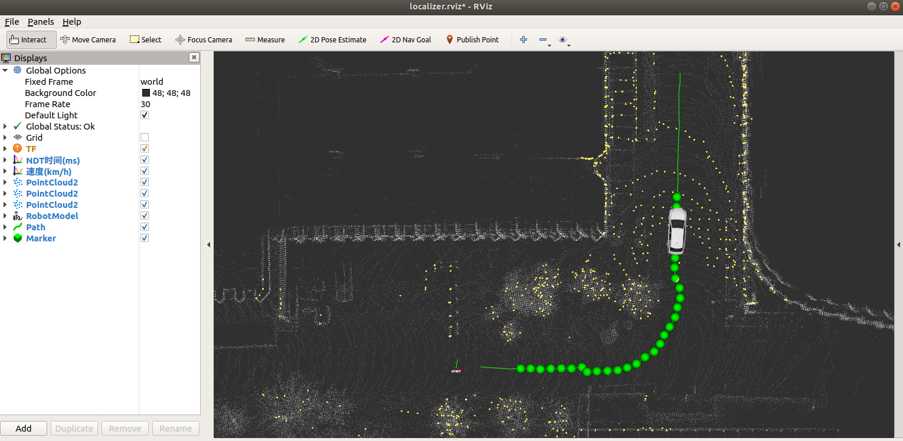

# Pure Pursuit




> To run this project, you need to complete the localization and record the waypoints.  
> Here are two corresponding projects: [
ROS_NDT_Localizer
](https://github.com/leofansq/ROS_NDT_Localizer) for the localization and [ROS_Waypoints_Processor](https://github.com/leofansq/ROS_Waypoints_Processor) for waypoints recording & loading :)

## Environment
* Ubuntu 18.04
* ROS Melodic

## Data
* Waypoints record file (.txt format)
* RosBag for offline testing

## IO
- input  
/waypoints (nav_msgs::Path)   
/odom (nav_msgs::Odometry) 

- output  
/cmd_acker (ackermann_msgs::AckermannDriveStamped)    
/cmd_vel (geometry_msgs::Twist)  
/lookahead  (visualization_msgs::Marker)

## How to use
* Move the project into the ROS workspace (e.g. ~/ros_ws/src/)
* Build the project in the ROS workspace
  ```bash
  cd ros_ws/
  catkin_make
  ```
* Setup the configuration in [pure_pursuit_node.launch](./launch/pure_pursuit_node.launch)
  
  ```xml
  <arg name="wheel_base" default="1.0" doc="wheelbase"/>
	<arg name="lookahead_distance" default="4.0" doc="lookahead distance"/>
	<arg name="w_max" default="1.0" doc="max rotational velocity"/>
	<arg name="position_tolerance" default="0.1" doc="position tolerance"/>
	<arg name="delta_vel" default="100.0" doc="steering angle velocity"/>
	<arg name="acc" default="100.0" doc="acceleration"/>
	<arg name="jerk" default="100.0" doc="jerk"/>
	<arg name="delta_max" default="1.57" doc="steering angle limit"/>
	<arg name="map_frame_id" default="map" doc="map frame id"/>
	<arg name="robot_frame_id" default="base_link" doc="robot frame id"/>
	<arg name="lookahead_frame_id" default="lookahead" doc="lookahead frame id"/>
	<arg name="acker_frame_id" default="rear_axle_midpoint" doc="ackermann frame id"/>
  ```

* Complete the localization and the waypoints loading steps, e.g. [
ROS_NDT_Localizer
](https://github.com/leofansq/ROS_NDT_Localizer) & [ROS_Waypoints_Processor](https://github.com/leofansq/ROS_Waypoints_Processor).

* Run the Pure-Pursuit
  * Source the setup.bash
    ```bash
    cd ros_ws
    source devel/setup.bash
    ```
  
  * Launch the Pure-Pursuit node
    ```bash
    roslaunch pure_pursuit pure_pursuit_node.launch
    ```

* Play the rosbag for offline testing
  ```bash
  rosbag play offline_testing.bag
  ```

* Subscribe the ackermann messages from the topic `/cmd_acker`.
  ```xml
  <!--  Demo  -->
  ---
  header: 
    seq: 224
    stamp: 
      secs: 1649337997
      nsecs:  48033928
    frame_id: ''
  drive: 
    steering_angle: 0.270921677351
    steering_angle_velocity: 100.0
    speed: 0.10000000149
    acceleration: 100.0
    jerk: 100.0
  ---
  ```

## Acknowledgment

Part of the code refers to the open-sourced project [Autoware](https://github.com/Autoware-AI/autoware.ai)

## Related projects in pure ROS (Melodic) 

* [ROS_NDT_Mapping](https://github.com/leofansq/ROS_NDT_Mapping)
* [ROS_NDT_Localizer](https://github.com/leofansq/ROS_NDT_Localizer)
* [ROS_Waypoints_Processor](https://github.com/leofansq/ROS_Waypoints_Processor)
* [ROS_Object_Cluster](https://github.com/leofansq/ROS_Object_Cluster)
